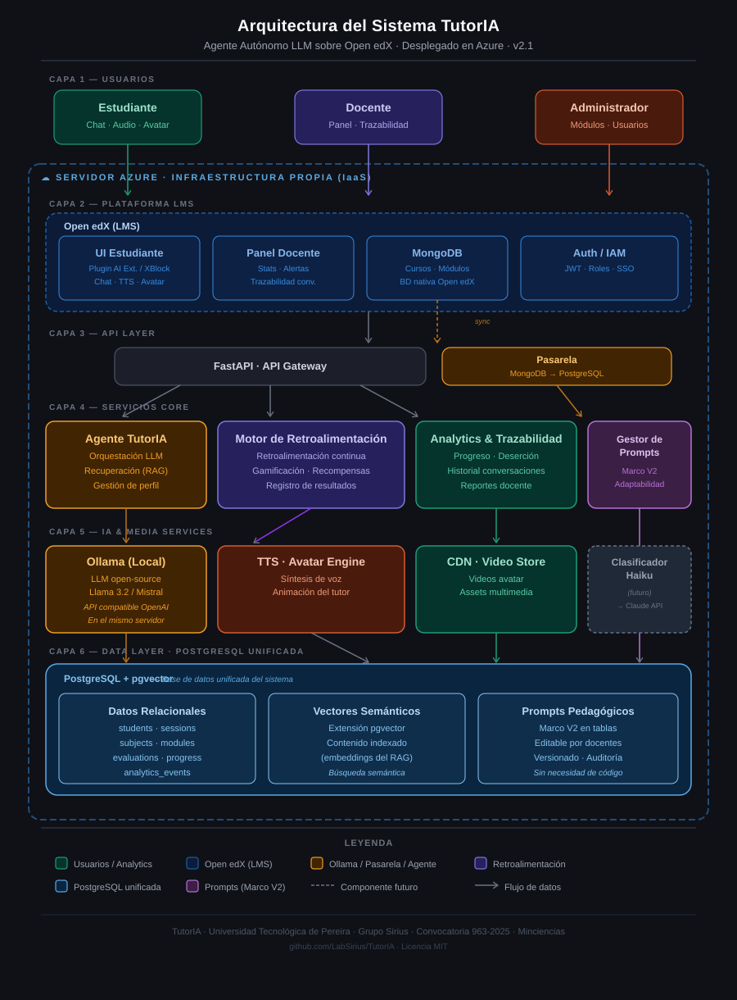

# TutorIA 🤖📚

> **Agente tutor virtual autónomo basado en IA para educación superior rural en Risaralda**  
> **Autonomous AI-powered virtual tutor agent for rural higher education in Risaralda, Colombia**

---

## Español

### ¿Qué es TutorIA?

TutorIA es un agente conversacional inteligente diseñado para acompañar a estudiantes de educación superior en zonas rurales del departamento de Risaralda, Colombia. Se integra dentro de la plataforma **Open edX** como herramienta de tutoría personalizada, ofreciendo retroalimentación continua, adaptabilidad pedagógica y elementos de gamificación para incentivar el aprendizaje.

El comportamiento pedagógico de TutorIA se rige por el **Marco Pedagógico V2** elaborado por la Dra. Luz Elena Grajales López, que define las estrategias de enseñanza, las reglas de adaptabilidad y la estructura curricular que el agente debe seguir.

### Características principales

- 💬 Chat conversacional en lenguaje natural (español colombiano)
- 🎙️ Respuestas por audio (Text-to-Speech)
- 🧑‍🏫 Avatar visual del tutor
- 🎮 Retroalimentación continua con elementos de gamificación
- 🔁 Persistencia del contexto entre sesiones
- 📚 Búsqueda semántica del contenido curricular (RAG con pgvector)
- 📊 Panel para docentes con estadísticas y trazabilidad completa de conversaciones
- 📐 Asignaturas iniciales: Programación I (Python) e Introducción a la Matemática

### Arquitectura del sistema



📄 [Documento de Requerimientos](docs/TutorIA_Requerimientos_V2.docx) · [Marco Pedagógico V2](docs/MArco_V2_texto.md)

### Stack tecnológico

| Capa | Tecnología |
|------|-----------|
| Backend | Python · FastAPI |
| Motor LLM (desarrollo/piloto) | Ollama (Llama 3.2 / Mistral) con API compatible OpenAI |
| Motor LLM (futuro) | Claude API (Anthropic) mediante clasificador Haiku |
| Base de datos | PostgreSQL con extensión **pgvector** (unifica datos relacionales, vectores semánticos y prompts pedagógicos) |
| Sincronización con Open edX | Pasarela MongoDB → PostgreSQL |
| LMS | Open edX (integración vía plugin `openedx-ai-extensions` o XBlock custom) |
| Infraestructura | Docker · Microsoft Azure (servidor propio, IaaS) |
| CI/CD | GitHub Actions |

> **Nota sobre Azure:** Azure se utiliza como **infraestructura** (servidor propio donde vive TutorIA), no como proveedor de LLM. El modelo de lenguaje corre localmente dentro del servidor Azure mediante Ollama. No se utiliza Azure OpenAI Service.

> **Nota sobre el LLM:** El sistema no reentrena modelos. Utiliza un LLM pre-entrenado (Ollama) y le proporciona el contexto del material curricular mediante RAG (búsqueda semántica en pgvector).

### Estructura del repositorio

```
tutoria/
├── backend/            # Backend FastAPI: agente, RAG, retroalimentación, analytics
│   ├── app/
│   │   ├── routers/    # Endpoints HTTP (chat, students, sessions, evaluations, analytics)
│   │   ├── services/   # Lógica de negocio (LLM, RAG, prompt_manager, gamification)
│   │   ├── models/     # Modelos SQLAlchemy + esquemas Pydantic
│   │   └── db/         # Motor de base de datos y migraciones Alembic
│   └── tests/
├── openedx/            # Plugin / XBlock para integración con Open edX
├── infra/              # Docker, docker-compose, configuración Azure
├── data/               # Corpus pedagógico (texto plano por asignatura y módulo)
├── docs/               # Documentación técnica, requerimientos, marco pedagógico
└── .github/            # GitHub Actions, plantillas de issues y PRs
```

### Cómo empezar (desarrollo local)

```bash
# 1. Clonar el repositorio
git clone https://github.com/LabSirius/TutorIA.git
cd TutorIA

# 2. Instalar Ollama y descargar un modelo
curl -fsSL https://ollama.com/install.sh | sh
ollama pull llama3.2

# 3. Copiar variables de entorno
cp backend/.env.example backend/.env
# Editar según sea necesario (por defecto apunta a Ollama local)

# 4. Levantar el entorno con Docker
docker-compose up --build
```

Documentación de la API una vez levantada: `http://localhost:8000/docs`

### Equipo

| Nombre | Rol |
|--------|-----|
| Dr. José Jaramillo Villegas | Director del Grupo de Investigación Sirius — dirección científica y técnica del proyecto |
| Dra. Luz Elena Grajales López | Dirección pedagógica — Marco Pedagógico V2, diseño educativo, materiales y capacitación docente |
| Sofía Soto Parra | Joven investigadora — desarrollo de software, gestión del repositorio y calidad |
| Santiago | Infraestructura cloud (Azure) |

**Institución:** Universidad Tecnológica de Pereira  
**Grupo de investigación:** Sirius  
**Financiación:** Convocatoria 963-2025 · Minciencias · Código 113575

### Licencia

Este proyecto es de código abierto bajo la licencia [MIT](LICENSE).

---

## English

### What is TutorIA?

TutorIA is an intelligent conversational agent designed to support higher education students in rural areas of the Risaralda department, Colombia. It is integrated within the **Open edX** platform as a personalized tutoring tool, offering continuous feedback, pedagogical adaptability, and gamification elements to encourage learning.

TutorIA's pedagogical behavior is governed by the **Pedagogical Framework V2** developed by Dr. Luz Elena Grajales López, which defines the teaching strategies, adaptability rules, and curriculum structure that the agent must follow.

### Key Features

- 💬 Natural language conversational chat (Colombian Spanish)
- 🎙️ Audio responses (Text-to-Speech)
- 🧑‍🏫 Visual tutor avatar
- 🎮 Continuous feedback with gamification elements
- 🔁 Session context persistence
- 📚 Semantic search over curricular content (RAG with pgvector)
- 📊 Teacher dashboard with statistics and full conversation traceability
- 📐 Initial subjects: Programming I (Python) and Introduction to Mathematics

### System Architecture


📄 [Requirements Document](docs/TutorIA_Requerimientos_V2.docx) · [Pedagogical Framework V2](docs/MArco_V2_texto.md)

### Tech Stack

| Layer | Technology |
|-------|-----------|
| Backend | Python · FastAPI |
| LLM engine (development/pilot) | Ollama (Llama 3.2 / Mistral) with OpenAI-compatible API |
| LLM engine (future) | Claude API (Anthropic) routed via Haiku classifier |
| Database | PostgreSQL with **pgvector** extension (unified store for relational data, semantic vectors and pedagogical prompts) |
| Open edX sync | MongoDB → PostgreSQL gateway |
| LMS | Open edX (integration via `openedx-ai-extensions` plugin or custom XBlock) |
| Infrastructure | Docker · Microsoft Azure (own server, IaaS) |
| CI/CD | GitHub Actions |

> **Note about Azure:** Azure is used as **infrastructure** (own server hosting TutorIA), not as an LLM provider. The language model runs locally inside the Azure server via Ollama. Azure OpenAI Service is not used.

> **Note about the LLM:** The system does not retrain models. It uses a pre-trained LLM (Ollama) and provides curricular content context via RAG (semantic search over pgvector).

### Repository Structure

```
tutoria/
├── backend/            # FastAPI backend: agent, RAG, feedback, analytics
│   ├── app/
│   │   ├── routers/    # HTTP endpoints (chat, students, sessions, evaluations, analytics)
│   │   ├── services/   # Business logic (LLM, RAG, prompt_manager, gamification)
│   │   ├── models/     # SQLAlchemy models + Pydantic schemas
│   │   └── db/         # Database engine and Alembic migrations
│   └── tests/
├── openedx/            # Plugin / XBlock for Open edX integration
├── infra/              # Docker, docker-compose, Azure configuration
├── data/               # Pedagogical corpus (plain text by subject and module)
├── docs/               # Technical documentation, requirements, pedagogical framework
└── .github/            # GitHub Actions, issue and PR templates
```

### Getting Started (local development)

```bash
# 1. Clone the repository
git clone https://github.com/LabSirius/TutorIA.git
cd TutorIA

# 2. Install Ollama and pull a model
curl -fsSL https://ollama.com/install.sh | sh
ollama pull llama3.2

# 3. Copy environment variables
cp backend/.env.example backend/.env
# Edit as needed (defaults to local Ollama)

# 4. Start the environment with Docker
docker-compose up --build
```

Once running, API docs are available at: `http://localhost:8000/docs`

### Team

| Name | Role |
|------|------|
| Dr. José Jaramillo Villegas | Director of the Sirius Research Group — scientific and technical leadership |
| Dr. Luz Elena Grajales López | Pedagogical direction — Pedagogical Framework V2, educational design, materials and teacher training |
| Sofía Soto Parra | Junior researcher — software development, repository management and quality assurance |
| Santiago | Cloud infrastructure (Azure) |

**Institution:** Universidad Tecnológica de Pereira  
**Research group:** Sirius  
**Funding:** Call 963-2025 · Minciencias · Code 113575

### License

This project is open source under the [MIT License](LICENSE).

---

*Proyecto financiado en el marco del Sistema Nacional de Ciencia, Tecnología e Innovación (SNCTI) — Colombia.*  
*Project funded within the Colombian National System of Science, Technology and Innovation (SNCTI).*